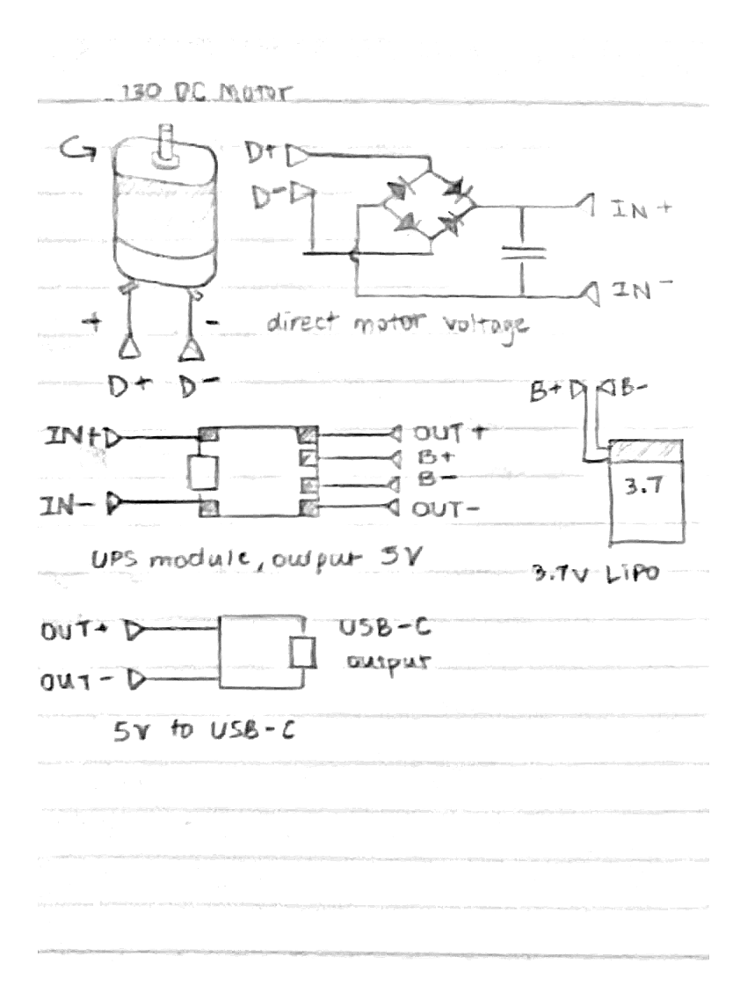

## sorry, my phone's dead

A dynamo (type of generator) for charging my phone, which is chronically dead.

## how does it work?

The principle of a dynamo is that, since the electromagnetic field causes a magnet to move positions, moving positions also changes the electromagnetic field. So, as a voltage spins a motor, spinning the motor also creates a voltage. This is the principle of many generators!

To get 5V out of it, we have to crank it really fast, through a gear train or some other gear-ratio-like system. 
I'm using a 130 motor, so we’d have to get the motor spinning at about 8300 RPM / 60 = 138 RPS. I thought about using a gear train to backdrive it but there seems to be too much friction, so I’m using a wheel and rubber band system.

However the voltage generated will be positive or negative, and anywhere between neg/pos 2-9V. 

To mitigate this, the flow goes like this:

- a full bridge rectifier with schottky diodes (low forward current) to convert it to "positive"
- positive goes into step-down UPS module, which charges battery, then also separately goes OUT as a regulated 5V
- 5V goes to USB-C breakout board.

| Wiring |
| :---: |
|  |
